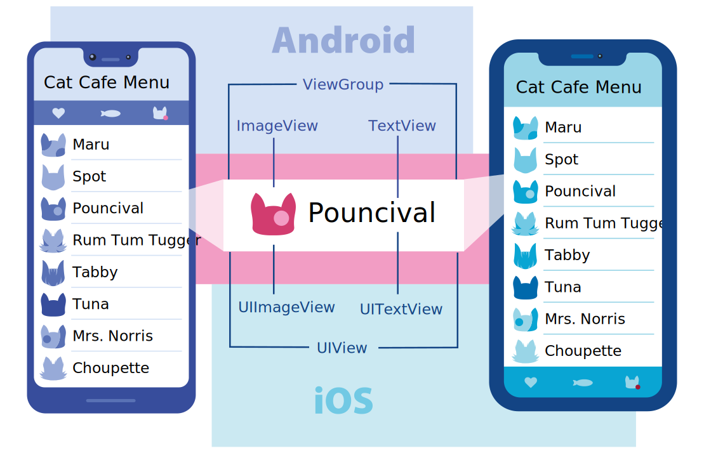
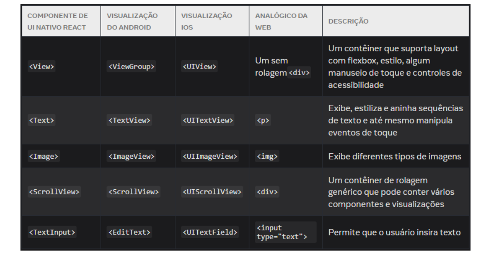
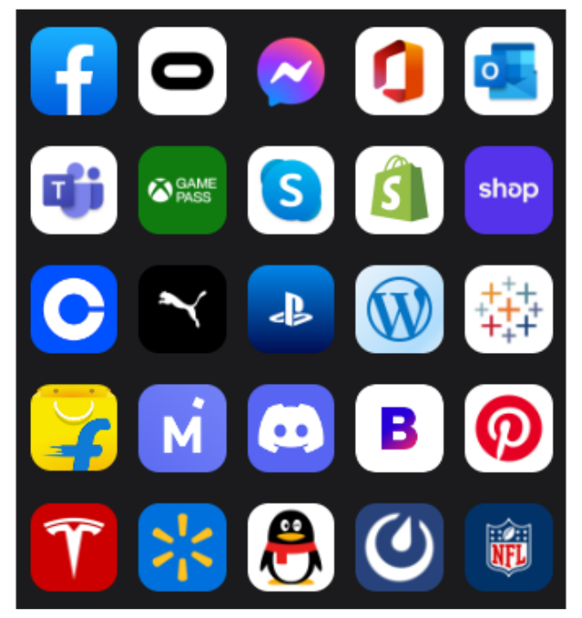
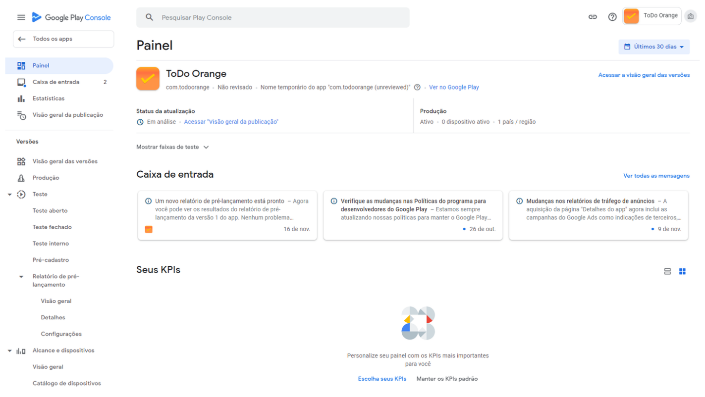
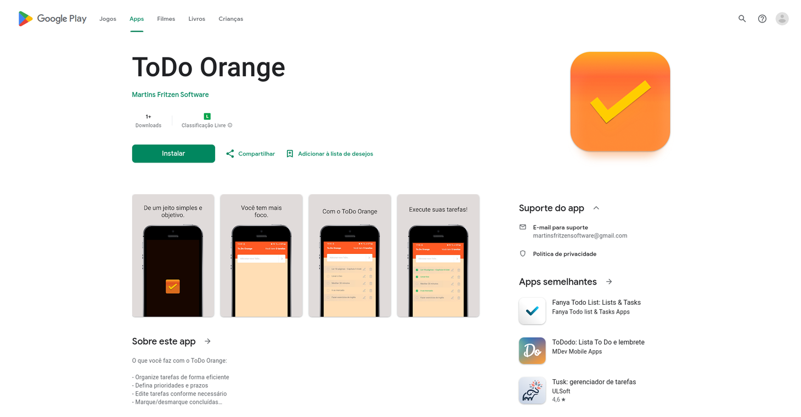
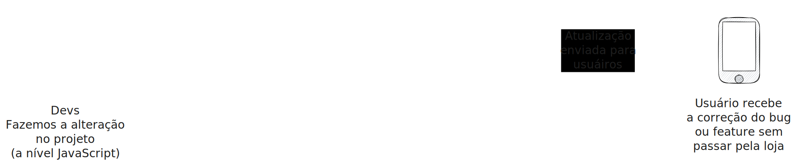
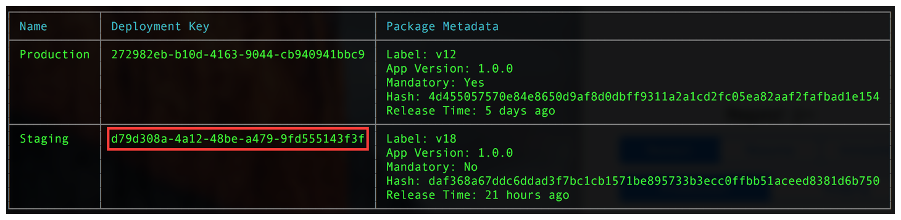
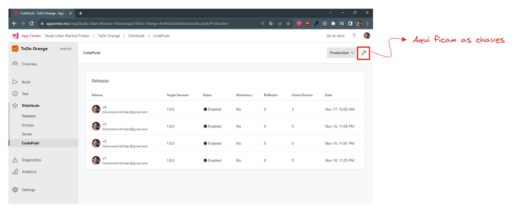

# ToDo Orange - Mobile não tem rollback!? E agora?

O ToDo Orange foi criado para demonstrar em ambiente de produção o uso do **OTA Update Method (Método de atualização pelo ar)**. Somente a versão Android foi publicada, estando disponível na loja Google Play. Portanto, o aplicativo recebeu apenas uma interface mais amigável, não possuindo nenhum tipo de implementação de armazendamento de dados.

## Sumário

<h3><a href="#RNRESUMO">Um pouco sobre o React Native</a></h3>

- O que é e como surgiu
- Integração com linguagens nativas

<h3><a href="#INITDEPLOY">Do Init ao Deploy</a></h3>

- Execução
- Aplicativo de exemplo
- Resumo (Exemplo Android - Google Play Console)
  Preparação
  Liberação na loja

<h3><a href="#OTA">Mobile não tem rollback!? E agora?</a></h3>

- OTA Update Method (Método de atualização pelo ar)
- Ferramenta CodePush
  - O que é
  - Como funciona
  - Quando se aplica

<h3><a href="#pesquisa">Referências de pesquisa</a></h3>

- Todos os links utilizados para a compilação das informações que constam neste repositório.

<h3><a href="#licenca">Licença</a></h3>

- Licença de uso

<h3><a href="#desenvolvedora">🙋‍♀️</a></h3>

- Bora tomar um ☕️

---

<br>
<h2 id="RNRESUMO">Um pouco sobre o React Native</h2>

Percebendo a popularização dos dispositivos móveis o Facebook sentiu a necessidade de criar aplicações hibridas
voltadas ao mundo mobile, com foco em alcançar a mesma performance dos aplicativos nativos (Android e iOS).
Sendo assim, a partir da biblioteca React o Facebook criou um estrutura em que houvesse uma comunicação
entre JavaScript e código nativo, transformando o código criado em códigio nativo, assim surgiu o React Native.

Descrito pela documentação como "Um framework de código aberto para construir aplicativos Android e iOS
usando React e os recursos nativos das plataformas de aplicativos."

Ainda hoje o Facebook mante´m o projeto, que teve seu lançmento em 2015 e três anos depois, em 2018, chegou a
marca de segundo repositório com o maior número de contribuidores no GitHub.

Atualmente, recebe apoio do mundo inteiro, desde pessoas desenvolvedoras a empresas,
incluindo Callstack, Expo, Infinite Red, Microsoft e Software Mansion.

O ecossistema do React Native possui algumas plataformas adicionais, como React Native Windows,
React Native macOS e React Native Web, além de Android e iOS, que seguem um movimento de
inovação a partir da comunidade.

#### Integração com Linguagem Nativa

Em Android e iOS, uma View é o bloco básico para a construção da interface do usuário.
A View é um elemento retangular na tela utilizado para mostrar texto, imagens ou reagir à
entrada do usuário. Até os menores elementos visuais, como linhas de texto ou botões,
são categorizados como "View", é possível que tenhamos umas dentro das outras, inclusive.



#### Componentes principais:



#### Quem utiliza o React Native



---

<h2 id="INITDEPLOY">Do Init ao Deploy</h2>
O aplicativo de exemplo, seria um MVP de um aplicativo de tarefas chamado ToDo Orange.

- Sua inicialização se deu a partir da CLI do React Native

A documentação fornece um guia de preparação de ambientes estando nos SOs MacOS, Windows ou Linux. Para o caso da Interface de Linha de Comando do React Native a preparação é um pouco mais extensa.

Focando em nosso exemplo, utilizando SO Linux, abaixo estão as ferramentas necessárias para instalação:

- Node (Recomendado > 16)
- Versão 11 do Java SE Development Kit (JDK)
- Android Studio:
- Android SDK
- Android SDK Platform
- Android Virtual Device

Comandos utilizados: - npx react-native@latest init ToDoOrange - npm start (Inicia o empacotador JavaScript que já vem por padão no React Native) - no próprio terminal é possível selecionar a letra "a" que executará por debaixo dos panos
o comando "npm run android" ou podemos abrir um terminal e exexutá-lo.

Este é um novo projeto [**React Native**](https://reactnative.dev), inicializado usando [`@react-native-community/cli`](https://github.com/react-native-community/cli).

### Primeiros passos

> **Nota**: certifique-se de ter concluído as instruções do [React Native - Environment Setup](https://reactnative.dev/docs/environment-setup) até a etapa "Criando um novo aplicativo", antes de continuar.

Se você for iniciar um novo projeto utilize o comando abaixo, após ter seguido todas as instruções contidas neste link acima.

```bash
npx react-native@latest init AwesomeProject
```

Caso pretenda utilizar este repositório como exemplo, faça um fork ou clone-o e após siga as estapas abaixo.

#### Etapa 1: instale as dependências

```bash
# use npm
npm install

# ou use Yarn
yarn install
```

#### Etapa 2: iniciar o servidor Metro

Primeiro, você precisará iniciar o Metro , o empacotador JavaScript que acompanha o React Native. Para iniciar o Metro, execute o seguinte comando na raiz do seu projeto React Native:

```bash
# use npm
npm start

# ou use Yarn
yarn start
```

#### Etapa 3: inicie seu aplicativo

Deixe o Metro Bundler rodar em seu próprio terminal. Abra um novo terminal na raiz do seu projeto React Native. Execute o seguinte comando para iniciar seu aplicativo Android ou iOS :

### Para Android

```bash
# use npm
npm run android

# ou use Yarn
yarn android
```

### Para iOS

```bash
# use npm
npm run ios

# ou use Yarn
yarn ios
```

Se tudo estiver configurado corretamente , você deverá ver seu novo aplicativo em execução no seu Android Emulator ou iOS Simulator em breve, desde que tenha configurado seu emulador/simulador corretamente.

Esta é uma maneira de executar seu aplicativo – você também pode executá-lo diretamente no Android Studio e no Xcode, respectivamente.

#### Solução de problemas

Se você não conseguir fazer isso funcionar, consulte a página [Troubleshooting](https://reactnative.dev/docs/troubleshooting).

#### Saiba mais

Para saber mais sobre React Native, dê uma olhada nos seguintes recursos:

- [Site React Native](https://reactnative.dev) - saiba mais sobre React Native.
- [Primeiros passos](https://reactnative.dev/docs/environment-setup) - uma **visão geral** do React Native e como configurar seu ambiente.
- [Aprenda o básico](https://reactnative.dev/docs/getting-started) - um **tour guiado** pelos **princípios básicos** do React Native .
- [Blog](https://reactnative.dev/blog) - leia as últimas postagens oficiais do React Native **Blog**.
- [`@facebook/react-native`](https://github.com/facebook/react-native) - o Código Aberto; **Repositório** GitHub para React Native.

### Expo Go

No guia de configuração de ambiente o React Native também sugere a utilização do Expo Go. Expo é um ecossistema que foi construído em torno do React Native e o recurso mais relevante apontado pela própria documentação é facilidade de iniciar a criação de um aplicativo mobile, sendo necessário apenas a versão mais recente do NodeJS.

Entretanto, é muito importante fazer uma análise sobre as limitações enfrentadas por esse conjunto de ferramentas, uma vez que o Expo não lida com a alteração de códigos nativos, que muitas vezes pode ser necessário para o crescimento do aplicativo.

### Código pronto para publicação nas lojas (Exemplo Android)

Se em qualquer momento nós quisermos testar o app em um dispositivo físico, sem emular, podemos gerar o Android Package, conhecido como apk, que seria basicamente nosso código em uma formato que o dispositivo Android consegue executar.

Para gerarmos o apk é necessário realizar a configuração de assinatura exigida pelo Android, após a configuração podemos executar o comando:

```bash
npm run android -- --mode="release"
```

- Encontraremos o apk no seguinte caminho `android/app/build/outputs/apk/release/app-release.apk`

#### Deploy realizado na Google Play

Para a liberação do aplicativo na loja o arquivo gerado possui uma extensão de nome aab, que significa Android App Bundle, a diferença é que este arquivo terá todos os recursos e códigos compilados do app e a partir deste arquivo a própria Google Play se encarrega de gerar os apks otimizados para a arquitetura de cada dispositivo.

- Para gerarmos o App Bundle vamos utilizar o código abaixo

```bash
  npx react-native build-android --mode=release
```

- Encontraremos o apk no seguinte caminho `android/app/build/outputs/bundle/release/app-release.aab`





#### Link do aplicativo na loja:

https://play.google.com/store/apps/details?id=com.todoorange

- **Disclaimer:** Gostaria de lembrar que entre criar o app e configurá-lo a ponto de que seja possível sua publicação, existem inúmeros detalhes e muitos deles são cobertos pela documentação do React Native e das linguagens nativas. Inclusive quanto ao cadastro e pagamento de taxas nas respectivas lojas (Google Play e Apple Store).

  A intenção deste repositório e focar no uso do método OTA, entretanto, mesmo que superficialmente achei que era conveniente demonstrar que existe um passo importante com relação à publicação nas lojas, porque não é possível pensar em manutenção da aplicação no ar, sem passar pelo processo de deploy.

<h2 id="#OTA">Mobile não tem rollback!? E agora?</h2>

O Over-the-air (OTA) update (Atualização pelo ar) é um método de distribuição de atualizações de serviço digital. Esse mecanismo não é recente e é comumente utilizado pela indústria de softwares embarcados.

A atualização pelo ar consiste no envio do software atualizado para um repositório central e este repositório se encarrega de enviar a atualização para parte ou todos os usuários do sistema via internet.

No dispositivo a atualização ocorre através do delta gerado a partir do processo chamado diffing. Delta ou codificação delta ou compactação delta é uma maneira de armazenar/transmitir dados cujo resultado é exatamente a diferenciação de dados (diffing) entre software antigo e novo.

Por si só esse processo já tem como resultado apenas uma pequena parte do software, mas vale lembrar que as atualizações OTA devem ser projetadas para consumirem a menor quantidade de recurso do usuário, pensando em energia, uso de rede e armazenamento.

Indústrias que utilizam esse recurso são:

- Smartphones
- Automotiva
- Internet das Coisas (IoT)
- Roteadores de Internet
- Redes de Celulares

#### Fazendo atualizações via ferramenta CodePush

O CodePush é um serviço em nuvem gratuito que está disponível dentro da plataforma App Center da Microsoft
(App Center é uma plataforma de integração, testes, distribuição e acompanhamento da saúde do app).

Funciona como um repositório central onde recebe as atualizações e se encarrega de enviá-las aos usuários.

Vale ressaltar que só é possível utilizar este recurso para atualizações onde não seja necessário recompilar
o software, ou seja, se a mudança afetar códigos nativos será necessário passar pelas lojas encaminhando
os novos executáveis. Portanto, a atualização pelo ar no caso do React Native deve ser realizada apenas
a nível JavaScript.



#### Implementando o SDK do CodePush

```bash
  npm install --save react-native-code-push
```

Instalação e configuração de plugin para React Native versão 0.60 e superior (Android)

1. No arquivo `android/settings.gradle`, faça as seguintes adições:

```bash
include ':app', ':react-native-code-push'
project(':react-native-code-push').projectDir = new File(rootProject.projectDir, '../node_modules/react-native-code-push/android/app')
```

2. Agora no arquivo android/app/build.gradle, adicione o codepush.gradle como uma definição de tarefa de build adicional:

```bash
...
apply from: "../../node_modules/react-native-code-push/android/codepush.gradle"
...
```

3. Atualize o arquivo MainApplication.java(ou MainApplicationReactNativeHost.java se você estiver usando React Native 0.68 - 0.70) para usar CodePush por meio das seguintes alterações:

```java
...
// 1. Import the plugin class.
import com.microsoft.codepush.react.CodePush;
public class MainApplication extends Application implements ReactApplication {
    private final ReactNativeHost mReactNativeHost = new ReactNativeHost(this) {
    ...
    // 2. Override the getJSBundleFile method to let
    // the CodePush runtime determine where to get the JS
    // bundle location from on each app start
    @Override
    protected String getJSBundleFile() {
        return CodePush.getJSBundleFile();
    }
  };
}
```

4. Adicione a chave de implantação a strings.xml:

Para permitir que o tempo de execução do CodePush saiba qual implantação ele deve consultar em busca de atualizações, abra o arquivo do seu aplicativo strings.xml e adicione uma nova string chamada CodePushDeploymentKey, cujo valor é a chave da implantação na qual você deseja configurar este aplicativo (como a chave para a Staging implantação do aplicativo).

Você pode recuperar esse valor executando

```bash
appcenter codepush deployment list -a <ownerName>/<appName> -kna
```

CLI do App Center (o `-ksinalizador` é necessário, pois as chaves não são exibidas por padrão) e copiando o valor da Keycoluna que corresponde à implantação que você deseja usar (veja abaixo). Usar o nome da implantação (como Staging) não funcionará. O "nome amigável" destina-se apenas ao uso de gerenciamento autenticado da CLI e não ao consumo público no seu aplicativo.



Para fazer uso eficaz das Staging implantações Productionque foram criadas junto com seu aplicativo CodePush, consulte os documentos de teste de múltiplas implantações abaixo antes de realmente mover o uso do CodePush do seu aplicativo para a produção.

Seu strings.xmlarquivo deve ficar assim:

```xml
<resources>
    <string name="app_name">AppName</string>
    <string moduleConfig="true" name="CodePushDeploymentKey">DeploymentKey</string>
</resources>
```

#### Recuperando chaves via App Center

Após fazer a integração do seu repositório e criação do aplicativo na plataforma App Center, selecione o aplicativo criado, vá em Distribute, CodePush e do lado superior direito verá um ícone de chave/ferramenta, ao lado estará informando a qual ambiente pertence essa chave (Production/Staging)



#### Commit de implementação

Abaixo está o link do commit da implementação do SDK e também da biblioteca react-native-config, sugiro também implementá-la, pois não é recomendável enviar para o repositório qualquer tipo de chave, então é interessante que as mantenha em variáveis de ambiente que não devem ser "commitadas".

[chore(deploy): react native config and code push settings](https://github.com/lilianmartinsfritzen/ToDoOrange/commit/baf2001c7157cf349a22318959dc891ca7e5156a)

#### Modos de instalação:

- IMMEDIATE (0): Instala a atualização e reinicia o aplicativo imediatamente. Usado para impor
  atualizações obrigatórias.

- ON_NEXT_RESTART (1): Não força a inicialização do aplicativo, a atualização acontece em segundo
  plano de forma sileciosa. Indicado quando a reinicialização repentina prejudicará a utilização do app
  pelo usuário.

- ON_NEXT_RESUME (2): Recebe a atualização, porém a atualização só ocorrerá após uma
  reanicialização natural, sem interromper a sessão atual, após o usuário retirar do segundo plano.

- ON_NEXT_SUSPEND (3): Atualiza somente em segundo plano e após uma duração mínima setada
  por meio da variável minimumBackgroundDurationsegundos.

#### Frequência de verificação:

- codePush.CheckFrequency.ON_APP_START (0): Verifica se existem atualizações sempre que o
  aplicativo é iniciado.

- codePush.CheckFrequency.ON_APP_RESUME (1): Verifica se existem atualizações sempre que o
  aplicativo é trazido do segundo plano.

- codePush.CheckFrequency.MANUAL (2): Verifica se há atualização quando o codePush.sync() é
  chamado, sendo possível deixar a verificação de atualização por conta do usuário por meio de um
  botão, por exemplo.

Existe também a possibilidade de acompanhar os status de sincronização e estado da atualização.

Comandos para liberar atualizações:

- Inicialmente é necessário fazer login na appcenter utilizando o comando abaixo

```bash
  appcenter login
```

Neste momento você terá que estar com login ativo no App Center ou ao menos com uma
sessão válida da ferramenta utilizada para integração, exemplo GitHub.

O App Center vai fornecer um token via navegador e será necessário apenas colar no terminal.

Em seguida, utilizando a cli do CodePush podemos enviar atualizações desde o comando mais
simples até o que conterá diversos parâmetros. Exemplos:

Só precisamos informar nome do proprietário + "/" + nome do aplicativo.

```bash
  appcenter codepush release-react -a <ownerName>/MyApp-iOS
  appcenter codepush release-react -a <ownerName>/MyApp-Android
```

É possível adicionar uma descrição do motivo da mudança:

```bash
  appcenter codepush release-react -a <ownerName>/MyApp-iOS  -m --description "Modified the header color"
```

Enviar a atualização para uma quantidade específica de usuários passando a tag `--rollout`.

```bash
appcenter codepush release-react -a <ownerName>/MyApp-Android  --rollout 25% --development true
```

Direcionar a atualização para usuários que estejam com uma versão específica instalada.

```bash
appcenter codepush release-react -a <ownerName>/MyApp-Android  --target-binary-version "~1.1.0"
```

#### Exemplo de atualização em produção

No exemplo abaixo fiz uma simulação de um usuário baixando o aplicativo direto da loja e começando a utilizá-lo, porém a aplicação subiu com um bug que causava o temido "crash" da aplicação. Gerando o fechamento repentino após o usuário desmarcar uma tarefa já marcada.

- Exemplo de quebra do aplicativo em produção, causado por um bug.
 
  https://github.com/lilianmartinsfritzen/ToDoOrange/assets/83084256/e30e4920-8e1c-4669-9761-675d69860010

No próximo vídeo a pessoa desenvolvedora detecta o motivo do crash, faz a correção e executa o comando para atualização do aplicativo sem passar pela loja. Perceba que é necessário colocar o app em background inicialmente e ao abrir ele faz a atualização e reinicia o app. Todos esses passos são configuráveis conforme mencionado nas etapas de **Modos de instalação** e **Frequência de verificação**.

- Correção de bug e atualização via CodePush.
  
  https://github.com/lilianmartinsfritzen/ToDoOrange/assets/83084256/b1ec522d-eac2-4e36-a9dd-81e2048f2559

Já nesse último vídeo quis trazer um exemplo de que mesmo a nível Javascript, ou seja, mesmo sem poder corrigir bugs ou criar features que altere código nativo, o uso do OTA é bastante poderoso e pode ser um ótimo aliado quando falamos de ferramentas que vão auxiliar na disponibilidade da sua aplicação.

Perceba que no caso abaixo criei um pequeno código que implementa um requisição buscando a minha lista de repositórios e exibindo-os em uma lista logo abaixo da implementação das tarefas, ou seja, isso nos abre portas para correções que de certa forma possam estar afetando buscas de produtos ou serviços a partir do aplicativo, de forma rápida e sem a necessidade de aguardar a liberação da loja.

- Implementação de requisição e atualização via CodePush.
  
  https://github.com/lilianmartinsfritzen/ToDoOrange/assets/83084256/18298843-922e-4dd1-a1b3-eec1521284b3

<h2 id="#pesquisa">Referências de pesquisa</h2>

Abaixo seguem todos os links utilizados para pesquisa e implementação do aplicativo e método OTA.

- [Site React Native](https://reactnative.dev/) - site React Native.
- [Principais componentes](https://reactnative.dev/docs/intro-react-native-components) - introdução aos principais componentes.
- [Quem usa](https://reactnative.dev/showcase) - quem faz uso do Framework React Native.
- [Assinatura de apk - Android](https://reactnative.dev/docs/signed-apk-android) - assinando o apk Android.
- [AAB](https://developer.android.com/guide/app-bundle) - o Android App Bundle.
- [OTA](https://en.wikipedia.org/wiki/Over-the-air_update) - o Over-the-air (OTA) update (Atualização pelo ar).
- [Delta ecoding](https://en.wikipedia.org/wiki/Delta_encoding) - a codificação delta ou compactação delta.
- [Diffing](https://en.wikipedia.org/wiki/Data_differencing) - a diferenciação de dados ou compressão diferencial.
- [Code Push](https://microsoft.github.io/code-push/) - site Code Push em App Center.
- [App Center - CodePush](https://learn.microsoft.com/pt-br/appcenter/distribution/codepush/) - documentação do Serviço CodePush.
- [Implementação - CodePush](https://learn.microsoft.com/en-us/appcenter/distribution/codepush/rn-get-started) - implementação do Serviço CodePush.
- [Android - CodePush](https://learn.microsoft.com/en-us/appcenter/distribution/codepush/rn-get-started#android-setup) - implementação do CodePush para Android.
- [Atualizações](https://learn.microsoft.com/en-us/appcenter/distribution/codepush/rn-updates) - liberando atualizações via CodePush.
- [Status](https://learn.microsoft.com/en-us/appcenter/distribution/codepush/rn-api-ref#syncstatus) - acompanhar status de atualização.
- [Sincronização](https://learn.microsoft.com/en-us/appcenter/distribution/codepush/rn-api-ref#syncoptions) - opções de sincronização.
- [InstallMode](https://learn.microsoft.com/en-us/appcenter/distribution/codepush/rn-api-ref#installmode) - modos de aplicação da instalação.
- [CheckFrequency](https://learn.microsoft.com/en-us/appcenter/distribution/codepush/rn-api-ref#checkfrequency) - frequência de verificação de atualização no servidor.

<br>

<h2 id="desenvolvedora">Desenvolvedora</h2>
   <br>
  <a href="https://www.linkedin.com/in/lilian-martins-fritzen/" target="blank">
    
  </a>
